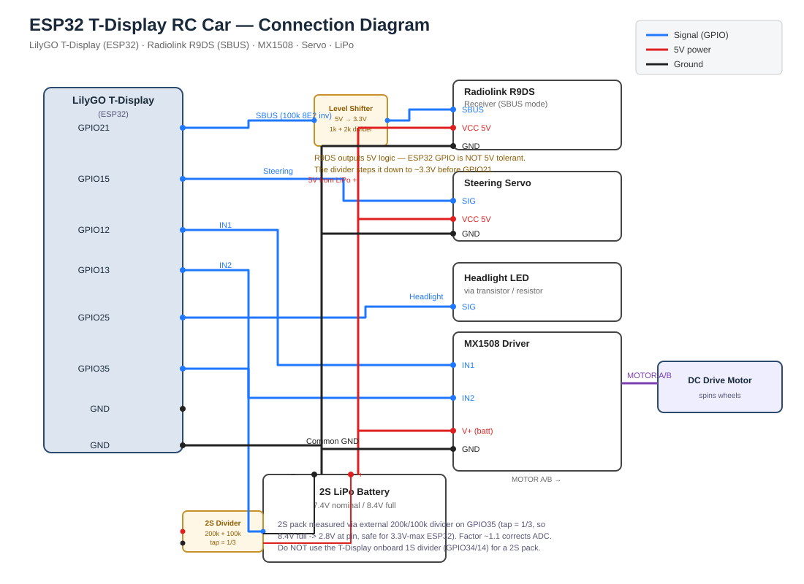

# ESP32 T-Display Radio Controlled Car (SBUS & TB6612FNG)

This project implements a complete, feature-rich firmware for a Radio Controlled (RC) Car using the **LilyGO T-Display (ESP32)**, the **TB6612FNG dual H-bridge motor driver**, and the **Radiolink R9DS receiver** (using the high-performance 1-wire SBUS protocol).

It reuses the hardware base of a toy RC car (small 130-size motor originally driven by 3×AA batteries ≈ 4.5V) on a **2S LiPo (7.4V nominal / 8.4V full)** pack, with a software "gear" limiter that caps the effective motor voltage so the toy motor is not over-driven.

It features:
- **1-Wire SBUS telemetry**: Zero-delay control of up to 16 channels with built-in signal-loss **failsafe** protection (stops the car if connection is lost).
- **Proportional DC Motor drive** via TB6612FNG (sign-magnitude: AIN1/AIN2 direction, PWMA speed). A software **gear limiter** caps the max PWM duty so the toy motor runs near its original 3×AA voltage.
- **3-position "gear" switch** (SBUS channel 5) → LOW / NORMAL / SPORT duty presets.
- **Proportional Servo steering**: Safe angle constraints to prevent mechanical binding of steering linkages.
- **On-screen color dashboard**: active throttle (bidirectional bar), steering angle, **motor direction + live TB6612FNG pin states (AIN1/AIN2/DUTY/STBY)**, gear, battery voltage, receiver frame-loss, failsafe state, and uptime.
- **Real-time 2S battery monitoring**: external 200k/100k divider on GPIO35 (safe — never exceeds 3.3V on the pin), with ADC calibration.

---

## 🔌 Connection Diagram (Pinout)

Ensure that all grounds are connected together (**Common Ground**)!

| Component | Pin / Port | ESP32 GPIO | Description |
| :--- | :--- | :--- | :--- |
| **Radiolink R9DS** | SBUS Signal | **GPIO 21** | Receiver SBUS output (level-shift 5V→3.3V, see below) |
| **Radiolink R9DS** | VCC | **5V** | Powers the receiver (supports 4.8V – 10V) |
| **Radiolink R9DS** | GND | **GND** | Ground connection |
| **Steering Servo** | Signal (Orange/Yellow) | **GPIO 15** | Servo PWM control signal |
| **Steering Servo** | Power (Red) | **5V** or Ext | Power line for the servo |
| **Steering Servo** | Ground (Brown/Black) | **GND** | Ground connection |
| **TB6612FNG (ch A)** | AIN1 | **GPIO 12** | Motor direction (H) |
| **TB6612FNG (ch A)** | AIN2 | **GPIO 13** | Motor direction (L) |
| **TB6612FNG (ch A)** | PWMA | **GPIO 26** | Motor speed (PWM) |
| **TB6612FNG (ch A)** | STBY | **GPIO 27** | Standby (H = enabled) |
| **TB6612FNG** | VM | *2S Battery (+) | Motor supply (2.5V – 13.5V) |
| **TB6612FNG** | VCC | **3.3V** | Logic supply — keep separate from VM! |
| **TB6612FNG** | AOUT1 / AOUT2 | *DC Motor* | Drive motor terminals |
| **TB6612FNG** | GND | *Battery (-) & GND* | Common ground |
| **Headlight LED** | Anode (via transistor) | **GPIO 25** | Headlight control |
| **2S Battery** | Divider tap | **GPIO 35** | 200k top / 100k bottom → safe 3.3V tap |

### Visual Wiring Diagram



> **Legend:** 🔵 Signal (GPIO) · 🔴 Power (battery / 5V) · 🟦 3.3V logic · ⚫ Ground · 🟣 Motor wires.
> Note: the Radiolink R9DS SBUS output is 5V logic — step it down to ~3.3V
> (1kΩ + 2kΩ divider) before GPIO 21, since ESP32 pins are **not 5V-tolerant**.

---

## ⚠️ Important: SBUS Voltage Logic Levels (5V vs 3.3V)

**ESP32 GPIO pins are not 5V-tolerant!**
Since the Radiolink R9DS receiver is powered by 5V, its SBUS output signal operates at 5V logic levels. Connecting this directly to **GPIO 21** of the ESP32 can damage or degrade the ESP32 microcontroller over time.

To protect your ESP32, you **must** use one of the following simple level-shifting methods:

### Method A: Voltage Divider (Recommended & Most Reliable)
Step down the 5V signal to a safe ~3.3V using two standard resistors:
- **Resistor R1 (1 kOhm)**: Connect in series between the receiver's SBUS output and GPIO 21.
- **Resistor R2 (2 kOhm)**: Connect between GPIO 21 and ESP32 GND.

```text
R9DS SBUS Out ───────[ 1 kOhm ]───────┬─────── GPIO 21 (ESP32)
                                     │
                                 [ 2 kOhm ]
                                     │
GND ─────────────────────────────────┴─────── GND
```
*(You can use other resistor values with a similar 1:2 ratio, such as 10 kOhm and 20 kOhm).*

### Method B: Current Limiting Resistor (Quick DIY Workaround)
If you don't have two resistors, place a single **1 kOhm to 4.7 kOhm resistor** in series between the SBUS Output and the GPIO 21 pin:

```text
R9DS SBUS Out ───────[ 1 kOhm ... 4.7 kOhm ]─────── GPIO 21 (ESP32)
```
This forces the ESP32's internal clamping ESD diodes to safely handle the excess voltage by limiting the current to a tiny fraction of a milliampere.

---

## ⚠️ Important: 2S Battery & Voltage Dividers

This build runs on a **2S LiPo** (7.4V nominal, **8.4V full charge**), NOT a 1S pack. The LilyGO T-Display's onboard battery divider (GPIO 34 / GPIO 14, /2 ratio) is designed for a 1S cell and would feed **> 3.3V** into the ESP32 at 2S — that can damage the pin.

Use an **external 200k / 100k divider** on **GPIO 35** instead (ratio /3):
- At 8.4V the tap reads 2.8V — safely below the 3.3V limit.
- The resistors draw only ~28 µA, so no enable pin is needed.
- Tune `BAT2S_CAL` (default `1.1`) against a multimeter reading for accurate voltage.

---

## ⚙️ Control Mapping & "Gear" Limiter

SBUS channel assignments (0-based indices) live in `src/main.cpp`:

```cpp
#define STEERING_CHANNEL  0   // Ch1 — steering
#define THROTTLE_CHANNEL  1   // Ch2 — throttle
#define GEAR_CHANNEL      4   // Ch5 — 3-position switch (gear limiter)
#define HEADLIGHT_CHANNEL 8   // Ch9 — 2-position switch (headlight toggle)
```

> **Note:** Channel 4 (index 3) is the left stick horizontal axis on the
> transmitter — it is intentionally **not** bound to anything in this firmware,
> so the gear limiter uses **Channel 5 (index 4)** instead. The headlight is on
> **Channel 9 (index 8)**, driven by a 2-position switch.

The toy motor is rated ~3×AA (4.5V). On a 2S pack (~8.4V full) that over-volts it, so a **software gear limiter** caps the max PWM duty (effective motor V ≈ packV × duty/255):

```cpp
#define GEAR_LOW_DUTY    110   // ~3.6V @ 8.4V pack  (gentle, protects the toy motor)
#define GEAR_NORMAL_DUTY 150   // ~4.9V @ 8.4V pack  (matches original 3×AA drive)
#define GEAR_SPORT_DUTY  200   // ~6.6V @ 8.4V pack  (lively, still under ~6V toy ceiling)
```

Move the 3-position switch to select the gear; the dashboard shows `G:LOW / G:NRM / G:SPT`.
A `GEAR_HYST` band around SBUS center prevents chatter when the switch sits near the middle.

To prevent physical damage to your steering linkage, you can also limit the maximum servo movement:
```cpp
#define SERVO_MIN_DEG 45   // Max left steering angle
#define SERVO_CENTER_DEG 90 // Perfectly straight steering
#define SERVO_MAX_DEG 135  // Max right steering angle
```

If your transmitter uses different channels, the **T-Display dashboard** shows live SBUS values, allowing you to troubleshoot and map them instantly.

---

## 📡 Configuring the Radiolink R9DS Receiver

The Radiolink R9DS receiver supports both PWM and SBUS modes. By default, it may be set to PWM. You **must** switch it to SBUS mode:
1. Power up the receiver.
2. Look at the receiver LED. If it is **Red**, it is in PWM mode.
3. **Double-press the small button** on the side of the receiver.
4. The LED should turn **Blue / Purple**. This indicates that the SBUS mode is active on the SBUS channel (bottom pin on the far-right row).

---

## 🚀 How to Compile and Flash

This project is built using **PlatformIO** (the modern ecosystem for embedded development).

### 1. Install PlatformIO
We highly recommend installing the **PlatformIO IDE** extension inside [VS Code](https://code.visualstudio.com/).

### 2. Open Project
Open the `rc-car` folder (e.g. `C:\Users\stas\Downloads\rc-car`) in VS Code / PlatformIO.

### 3. Build & Upload
- To compile the firmware, click the **Build** checkmark icon in the bottom status bar, or run:
  ```bash
  pio run
  ```
- Connect your LilyGO T-Display via USB-C.
- Click the **Upload** arrow icon, or run:
  ```bash
  pio run --target upload
  ```
- To view logs and telemetry from your computer, open the Serial Monitor (115200 baud):
  ```bash
  pio device monitor
  ```

---

## 🖥️ Dashboard Reference

Updated every 200 ms. In landscape (240×135):

| Line | Meaning |
| :--- | :--- |
| `RC CAR: ACTIVE` / `FAILSAFE / NO SIG` | Link status (green / red) |
| `Battery: xx.xx V` | 2S pack voltage (red < 6.8V, yellow < 7.4V, green above) |
| `Steer (Ch1): <val> -> <deg> deg` | Steering channel raw value + servo angle |
| *(blue bar)* | Steering position, left→right |
| `Throt (Ch2): <val> -> <pct>%` | Throttle channel + commanded % |
| *(green/red bar)* | Throttle: green forward, red reverse, from center |
| `Motor: <DIR> <pct>% G:<gear>(Ch5)` | Direction (FWD/REV/BRAKE/STOP), motor %, gear (Ch5 = 3-pos switch) |
| `AIN1:x AIN2:x DUTY:xxx STBY:x` | Live TB6612FNG control pins. `DUTY` is the real analogWrite value (0–255), not the pin logic level |
| `L:ON/OFF Up:<s>s` | Headlight state (Ch9 switch) + uptime |

---

## 🛠️ Project Structure

- `platformio.ini` - Project configuration, automated library dependencies, and seamless TFT build-flags.
- `src/main.cpp` - Core loop, SBUS parsing, gear limiter, safety watchdog/failsafe, and color UI dashboard.
- `src/sbus.h` - Lightweight, non-blocking custom SBUS parser using hardware UART signal inversion.
- `src/motor.h` - `TB6612Motor` abstraction: sign-magnitude drive, STBY control, PWM-duty limiter (`setMaxDuty`), and live-pin telemetry (`getDirection`, `getPwmDuty`, `getPin*`).
- `connection-diagram.svg` - Vector wiring diagram (ESP32 / R9DS / servo / TB6612FNG / 2S battery + divider).
